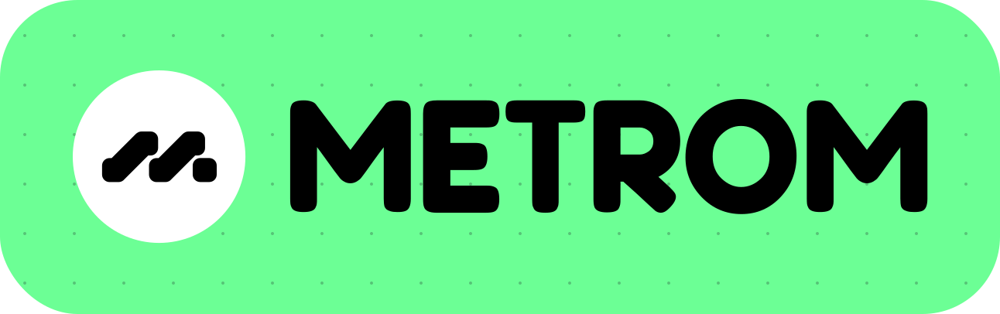

 

    

 

    Design your incentives to AMMplify liquidity.

 

    
    

# Metrom monorepo

A monorepo for all things Metrom. The packages are managed through `pnpm`
workspaces and `turborepo`.

## Packages

The monorepo contains the following packages under the `packages` folder:

- `frontend`: The official Metrom frontend built with Next.js.
- `graph-cli`: A CLI to deploy subgraphs on Metrom.
- `react`: A collection of React hooks a for seamless and efficient integration
  with Metrom.
- `sdk`: A general-purpose SDK for interacting with Metrom. It provides
  interfaces for Metrom entities, clients to fetch protocol data from services
  like `backend` and `data-manager`, and utility functions.
- `ui`: A React-based implementation of the Metrom design system, developed in
  TypeScript and documented with Storybook. Widely used in the frontend for UI
  components.

Additionally, there are subgraph folders under `subgraphs` for different AMM
variants supported by Metrom, and also the official Metrom subgraph
implementations.
